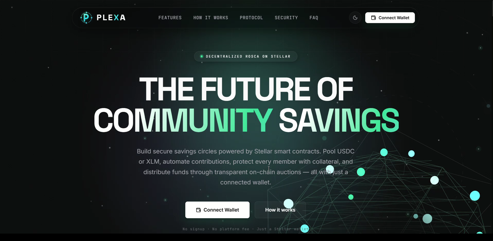
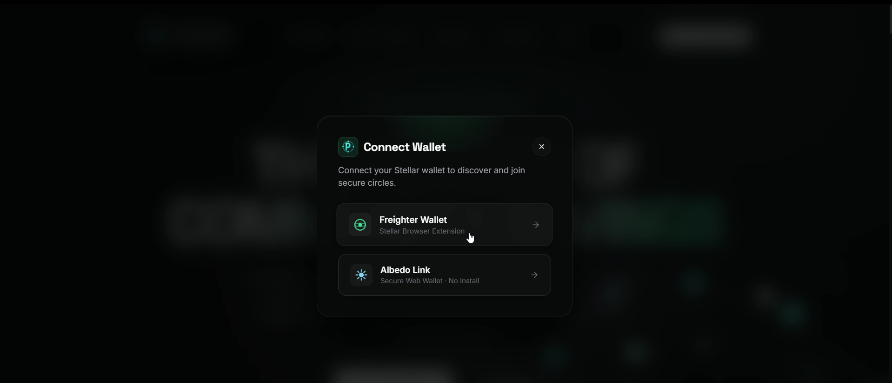
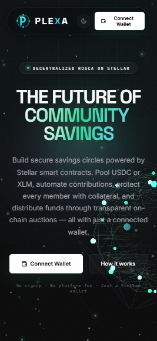

# Plexa — Decentralized ROSCA Protocol on Stellar / Soroban

Plexa is a decentralized **Rotating Savings and Credit Association (ROSCA)** protocol
built on Stellar's Soroban smart-contract platform. A group of members each contribute a
fixed amount per period into a shared pot; every period exactly one member receives the
pot — chosen by an open **discount auction** with a random fallback. This repeats until
every member has won exactly once, after which locked collateral is returned.

Think of it as a trustless, on-chain version of the informal savings circles
(known as *susu*, *tanda*, *chit fund*, *hui*, *chama*…) used by billions of people —
but with programmable collateral, automatic default coverage, and a transparent, publicly
verifiable ledger of every action.

---

## Table of Contents

- [Key Features](#key-features)
- [Screenshots](#screenshots)
- [How a ROSCA Round Works](#how-a-rosca-round-works)
- [Architecture](#architecture)
- [Smart Contracts](#smart-contracts)
- [Group Lifecycle & Period Mechanics](#group-lifecycle--period-mechanics)
- [Tech Stack](#tech-stack)
- [Deployed Contracts (Testnet)](#deployed-contracts-testnet)
- [Repository Layout](#repository-layout)
- [Getting Started](#getting-started)
- [Building, Testing & Deploying Contracts](#building-testing--deploying-contracts)
- [Design Decisions](#design-decisions)
- [Status & Roadmap](#status--roadmap)

---

## Key Features

- **Rotating payouts** — one member wins the pot each period until everyone has won once.
- **Open discount auction** — members bid the discount they'll give up to win early; the
  discount is redistributed equally among all members. A ledger-seeded PRNG breaks the
  no-bid case.
- **Per-group currency** — each group runs entirely in **USDC** *or* **XLM**
  (contributions, pot, payouts, and claims all flow in the chosen currency).
- **Multi-asset collateral** — members lock collateral to join:
  - USDC groups: USDC at **100%** of pot, or XLM at **150%** (oracle-sized, health-factor
    monitored).
  - XLM groups: same-asset XLM at **100%** of pot (no oracle / no swaps needed).
- **Automatic default coverage** — a dedicated **settlement window** liquidates a missed
  contribution from the member's collateral. For USDC groups this swaps only the needed
  XLM → USDC through the **real Soroswap testnet router**; uncoverable shortfalls become
  tracked on-chain debt instead of bricking the group.
- **Health factor + top-up grace** — XLM collateral is continuously valued; if it drops
  below 1.0 the member has one cycle to top up (XLM or USDC) or be liquidated.
- **On-chain governance** — majority-vote join approval, per-group reputation gating.
- **Full transparency** — every state change emits an event **and** is written to an
  on-chain history log the frontend reads directly.
- **Demo mode** — the whole UI runs offline against an in-memory store (no wallet, no
  chain) for local development and demos.

---

## Screenshots

| Landing page | Multi-account wallets | Group phase view |
|:---:|:---:|:---:|
|  |  |  |

> 📸 For more screenshots (group creation, collateral lock, auction round, Freighter/Albedo
> connect, claiming payouts, …) see the [`screeenshot/`](screeenshot) folder.

---

## How a ROSCA Round Works

```
Members join → lock collateral → auto-start when full & funded
        │
        ▼
  ┌─────────────────── each period ───────────────────┐
  │  Contribution → Settlement → Auction → Payout      │
  │  everyone pays   cover misses  bid to win  winner   │
  │                                 the pot    is paid   │
  └────────────────────────────────────────────────────┘
        │  (repeat: each member wins exactly once)
        ▼
   Cycle complete → grace window → withdraw remaining collateral
```

---

## Architecture

```
┌──────────────────────────────────────────────────────────────────────┐
│                          Frontend (React + Vite)                        │
│   Landing · Groups · CreateGroup wizard · GroupDetail · Dashboard       │
│   Freighter wallet · @stellar/stellar-sdk · notifications · demo mode   │
└───────────────┬────────────────────────────────────────────────────────┘
                │ simulate (reads) / prepare · sign · submit · poll (writes)
                ▼
┌──────────────────────────────────────────────────────────────────────┐
│                     Soroban Contracts (Rust workspace)                  │
│                                                                          │
│   ┌────────────┐  create_group()   ┌──────────────────────────────┐    │
│   │  Factory   │ ─────────────────▶ │  Group  (one per ROSCA)       │    │
│   │ discovery  │  reputation sync   │  members · collateral · pot   │    │
│   │ reputation │ ◀───────────────── │  auction · periods · history  │    │
│   └────────────┘                    └───────┬───────────┬──────────┘    │
│                                              │ price     │ swap          │
│                                              ▼           ▼               │
│                                       ┌──────────┐  ┌──────────────┐     │
│                                       │  Oracle  │  │  Soroswap     │     │
│                                       │ XLM/USDC │  │  Router       │     │
│                                       │  price   │  │ (XLM→USDC)    │     │
│                                       └──────────┘  └──────────────┘     │
└──────────────────────────────────────────────────────────────────────┘
                       │ token transfers (USDC / XLM SACs)
                       ▼
                Stellar Testnet (Protocol 23)
```

- **Reads** go through `simulateTransaction` (no signature, no fee).
- **Writes** are built, `prepareTransaction`-simulated, signed by the user's Freighter
  wallet, submitted, then polled for `SUCCESS`.
- The **Group contract** calls the **Oracle** for collateral sizing/health factors and the
  **Soroswap router** for liquidation swaps — the frontend never talks to Soroswap
  directly.

---

## Smart Contracts

A 4-crate Rust workspace (`contracts/`), each compiled to a Soroban Wasm contract.

### `plexa-factory` — deployment, discovery & reputation
- `create_group(CreateParams)` — deploys a new Group instance (`deploy_v2` + constructor),
  registers it, and lists it in the public discovery feed when `Public`.
- `sync_reputation(group)` — permissionless, idempotent; pulls reputation from a completed
  group into the cross-group registry.
- Views: `rep_of`, `get_public_groups`, `get_all_groups`, `admin`.

### `plexa-group` — one instance per ROSCA
Holds all group state: config, members, collateral (per-asset buckets), contributions,
period/phase timing, auction state, governance votes, and win history.

| Function | Purpose |
|---|---|
| `__constructor(GroupParams)` | Locks immutable params (incl. `currency`) at deploy. |
| `request_join` / `vote_on_join` | Majority-vote join approval. |
| `lock_collateral(member, asset)` | Lock collateral to become a member. |
| `top_up(member, asset, amount)` | Add collateral to restore a low health factor. |
| `contribute(member)` | Pay a period's contribution (funds period 1 while Forming). |
| `settle` | Verify contributions, liquidate misses, finalize pot, update health factors. |
| `place_bid(member, discount)` | Open auction bid — the discount given up to win. |
| `resolve_period` | Pick winner (top bid / random), split discount, advance period. |
| `claim_payout(member)` | Claim payouts + redistributed discount to wallet. |
| `withdraw_collateral(member)` | Withdraw remaining collateral after cycle + grace. |
| **Views** | `get_config/state/members/phase/claimable/current_bid/join_request/pending_joins/history`, `has_won`, `is_completed`, `get_settled`, `get_pot`, `health_factor`, `required_collateral`, `collateral_unlock_at` |

### `plexa-oracle` — XLM/USDC price feed
Admin-set price (7-decimal fixed point), used only for XLM-collateral sizing and health
factors. ⚠️ **Must be replaced with a real feed (e.g. Reflector) before mainnet** — an
admin-set price controls collateral valuation.

### `plexa-swap` — Soroswap-compatible venue *(testnet fallback)*
A mock XLM→USDC router matching the Soroswap router ABI, kept as an emergency fallback.
The live deployment liquidates through the **real Soroswap testnet router** instead.

---

## Group Lifecycle & Period Mechanics

- **Auto-start** — a group starts automatically when member count == target **and** all
  collateral is locked **and** all first contributions are paid. There is no "start" button.
- **Four windows per period** — `contribution → settlement → auction → payout`, derived
  from `period_length` (`payout = period − contribution − settlement − auction`). The
  settlement window is creator-configurable for dev/testing.
- **Settlement** (`settle`, permissionless — auto-run by `place_bid`/`resolve_period` as a
  safety net) verifies contributions, liquidates unpaid members (same-currency bucket
  first, then a minimal XLM→USDC swap via Soroswap for USDC groups), finalizes the pot, and
  recomputes health factors. The auction always starts from a full pool.
- **Open auction** — highest discount leads; bids are public. The winner receives
  `pot − discount`, and the discount is split equally among **all** members incl. the
  winner (integer-division dust goes to the winner). A member who has already won cannot
  bid again.
- **Default coverage** — a missed contribution is covered from collateral and logged. If
  collateral can't fully cover it, the shortfall is recorded as **debt** (netted from
  future claims/collateral) and the group keeps running — payouts reflect what was actually
  collected (`pot_collected`).
- **No-bid fallback** — a ledger-seeded PRNG (`env.prng()`) picks the winner. It only
  chooses *order*, never *whether* someone wins (everyone wins exactly once).

---

## Tech Stack

| Layer | Technology |
|---|---|
| **Smart contracts** | Rust · [Soroban SDK](https://soroban.stellar.org) `22.0.11` · `no_std` |
| **Build targets** | `wasm32v1-none` (deploy) · `wasm32-unknown-unknown` (release) |
| **Chain** | Stellar Testnet (Protocol 23) · Soroban RPC |
| **Tooling** | `stellar-cli` 26+ · Cargo workspace (4 crates) |
| **Frontend** | React 18 · TypeScript 5 · Vite 5 |
| **Chain SDK** | `@stellar/stellar-sdk` 16 · `@stellar/freighter-api` |
| **Wallet** | Freighter (browser extension) |
| **UI / motion** | Custom dark design system · Framer Motion · Lucide icons · Lenis |
| **Routing** | React Router 6 |
| **DeFi integrations** | Soroswap Router (liquidation swaps) · price oracle |

---

## Deployed Contracts (Testnet)

Current live deployment (**v5** — real Soroswap liquidation), from `frontend/.env`:

| Contract | Address |
|---|---|
| **Factory** | `CD6OKM7JO3BFZ644VM6J7NP4BVXEDUQYDR4SFJJJNGDK2KWP3DFIVAMY` |
| **USDC** (Circle testnet SAC) | `CBIELTK6YBZJU5UP2WWQEUCYKLPU6AUNZ2BQ4WWFEIE3USCIHMXQDAMA` |
| **XLM** (native SAC) | `CDLZFC3SYJYDZT7K67VZ75HPJVIEUVNIXF47ZG2FB2RMQQVU2HHGCYSC` |
| **Oracle** (XLM/USDC, admin-set) | `CBIXRTMPUHTK5YHVLPKXOKTJVOT3DV2WWNKDMZMZZTOMSOOA654BS7PO` |
| **Soroswap Router** | `CCJUD55AG6W5HAI5LRVNKAE5WDP5XGZBUDS5WNTIVDU7O264UZZE7BRD` |

- **Network:** `Test SDF Network ; September 2015` · RPC `https://soroban-testnet.stellar.org`
- **Group Wasm hash:** `d58bb092c6ca36d38343983a07c17940c1bb7100b9d0524a9a58d54c8d17f3bb`
- **Mainnet Soroswap router (for later, re-verify before use):**
  `CAG5LRYQ5JVEUI5TEID72EYOVX44TTUJT5BQR2J6J77FH65PCCFAJDDH`

> Amounts use `i128` at **7 decimals** (Stellar convention): `1 USDC = 10_000_000`.
> Older factory/USDC deployments are retained (commented) in `frontend/.env`.

---

## Repository Layout

```
Plexa(v1)/
├── contracts/                Soroban smart contracts (Rust workspace)
│   ├── group/                Group contract — one instance per ROSCA
│   ├── factory/              Factory — deploys groups + discovery + reputation
│   ├── oracle/               XLM/USDC price feed (admin-set for dev)
│   ├── swap/                 Soroswap-compatible mock router (testnet fallback)
│   └── Cargo.toml            Workspace manifest
├── frontend/                 React + TypeScript + Vite app
│   └── src/
│       ├── pages/            Landing · Groups · CreateGroup · GroupDetail · Dashboard · Profile
│       ├── components/       Header · GroupCard · WalletModal · PriceChart · …
│       ├── lib/              contracts.ts · wallet.ts · config.ts · demo.ts · notifications.ts
│       └── types.ts          Shared contract/UI types
├── scripts/                  build.sh · deploy.sh · test.sh
└── README.md
```

---

## Getting Started

### Prerequisites
- **Node.js 18+** and npm (frontend)
- **Rust 1.96+** with `wasm32v1-none` / `wasm32-unknown-unknown` targets (contracts)
- **[Freighter](https://freighter.app)** browser extension (for real testnet mode)
- **[stellar-cli](https://developers.stellar.org/docs/tools/cli) 26+** (deploying)

### Run the frontend

```bash
cd frontend
npm install
npm run dev            # → http://localhost:5173
```

Modes (set in `frontend/.env`):
- `VITE_DEMO=true` — **offline demo**: connects instantly as a simulated account, uses an
  in-memory + localStorage store. No wallet, no chain.
- `VITE_DEMO=false` — **real testnet**: signs with Freighter and submits to the deployed
  factory above. Fund your account and grab testnet USDC from Circle's faucet.

Build / typecheck:

```bash
npm run build          # tsc + vite build
npm run lint           # tsc --noEmit
```

---

## Building, Testing & Deploying Contracts

Toolchain: `rustc`/`cargo` 1.96+, `stellar-cli` 26+.

```bash
cd contracts

# Build deployable wasm (use the wasm32v1-none target — testnet rejects the
# reference-types/multivalue output of wasm32-unknown-unknown).
cargo build --target wasm32v1-none --release --offline

# Run unit tests
./scripts/test.sh      # or: cargo test   (see Windows note)
```

Deploy (see `scripts/deploy.sh`): upload the group wasm → deploy oracle, swap, and the
factory (with `--admin`, group wasm hash, USDC/XLM SACs, oracle, router) → call
`factory.create_group(...)`.

### ⚠️ Windows (GNU toolchain) test note
On `x86_64-pc-windows-gnu`, building the native `cdylib` for `cargo test` hits the PE
"export ordinal too large" linker limit (unrelated to contract code; the wasm build is
unaffected). Temporarily set `crate-type = ["rlib"]` in each crate's `Cargo.toml`, run
tests, then restore `["cdylib", "rlib"]`. `scripts/test.sh` automates this swap.

---

## Continuous Integration / Deployment

GitHub Actions workflows live in [`.github/workflows/`](.github/workflows):

| Workflow | Trigger | What it does |
|---|---|---|
| **`ci.yml`** | push / PR to `main` | **Contracts:** `cargo test` + Wasm build on Linux (fmt/clippy advisory). **Frontend:** `npm ci` → `npm run lint` (tsc) → `npm run build`. Uploads Wasm + `dist` artifacts. |
| **`deploy-contracts.yml`** | manual (`workflow_dispatch`) | Builds the `wasm32v1-none` artifacts and runs `scripts/deploy.sh` to deploy oracle + swap + factory. |

Notes:
- CI runs on **Linux**, which sidesteps the Windows-GNU `cdylib` linker limit — no
  crate-type swap needed, so `cargo test --workspace` runs directly.
- The deploy workflow is **manual-only** and needs a repository secret
  **`STELLAR_SECRET_KEY`** (the funded deployer's `S…` seed). It's gated behind a GitHub
  **Environment** matching the chosen network for approval control.

## Design Decisions

Choices explicitly surfaced rather than silently defaulted:

1. **Platform fee** — *removed for v1.* No fee is taken from any pot; re-introducing it is
   an isolated change in `resolve_period`.
2. **Collateral depletion** — *deduct + flag, group continues.* Uncovered defaults become
   on-chain debt (netted from future claims); the defaulter is flagged and payouts reflect
   what was actually collected.
3. **No-bid randomness** — *`env.prng()` (ledger-seeded).* Cheap and dependency-free, but
   not manipulation-proof against validators — acceptable for the low-value fallback
   (order only). Swap in commit-reveal / VRF later if needed.
4. **Reputation** — *count of cleanly-completed cycles*, held in the Factory registry,
   read at join time. A group's `min_reputation` gates joining; `0` disables the gate.

**Other flags:** the on-chain `history` Vec grows unbounded (fine for typical groups);
`resolve_period` is permissionless (a keeper bot can advance periods).

---

## Status & Roadmap

- [x] Group, Factory, Oracle, Swap contracts — built + unit tested
- [x] Per-group currency (USDC / XLM), multi-asset collateral, settlement window
- [x] Real Soroswap liquidation integration, verified end-to-end on testnet
- [x] Frontend (create wizard, dashboard, group view, governance, notifications) —
      typechecks + production build pass
- [x] Offline demo mode
- [ ] **Mainnet blockers:** replace the admin-set oracle with a real feed (Reflector);
      audit; paged/event-sourced history storage
- [ ] End-to-end JS integration tests against deployed wasm

---

<sub>Built on [Stellar](https://stellar.org) · [Soroban](https://soroban.stellar.org). Testnet only — not audited, not for real funds.</sub>
