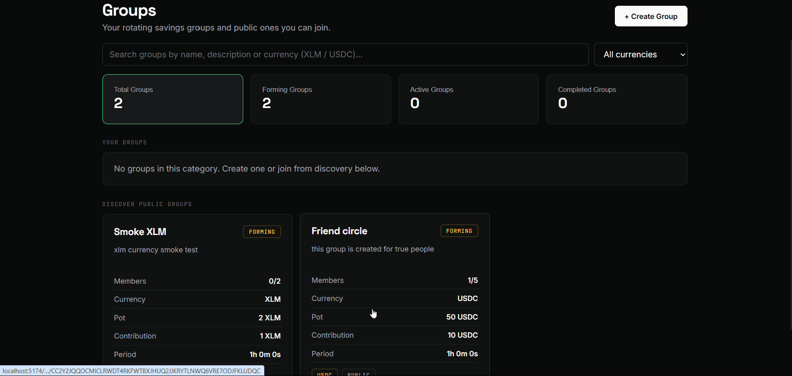
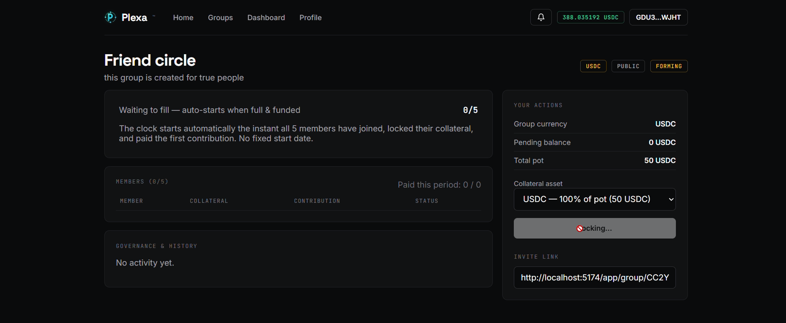
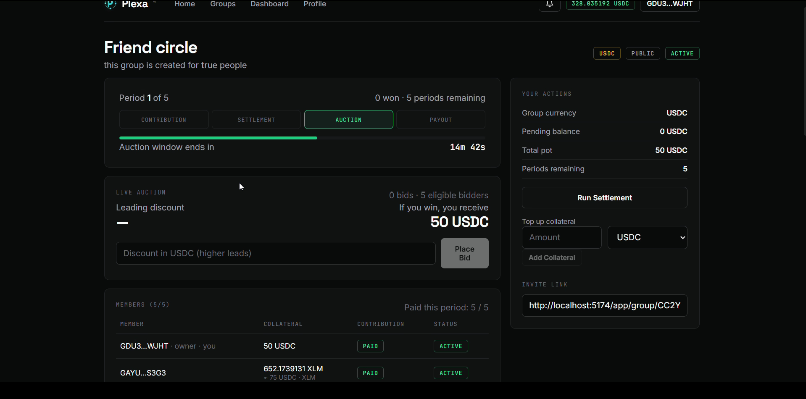
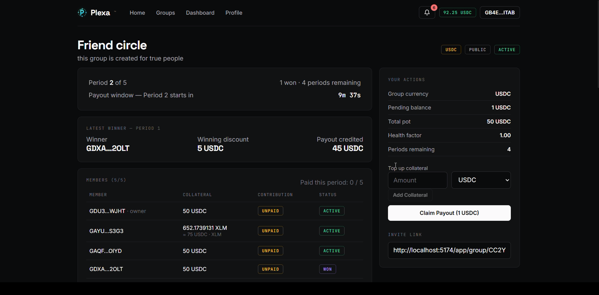
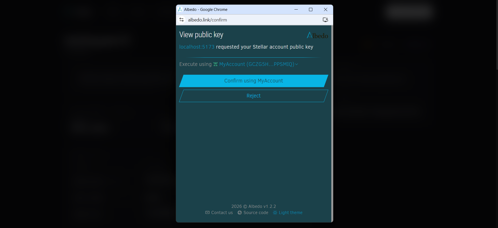
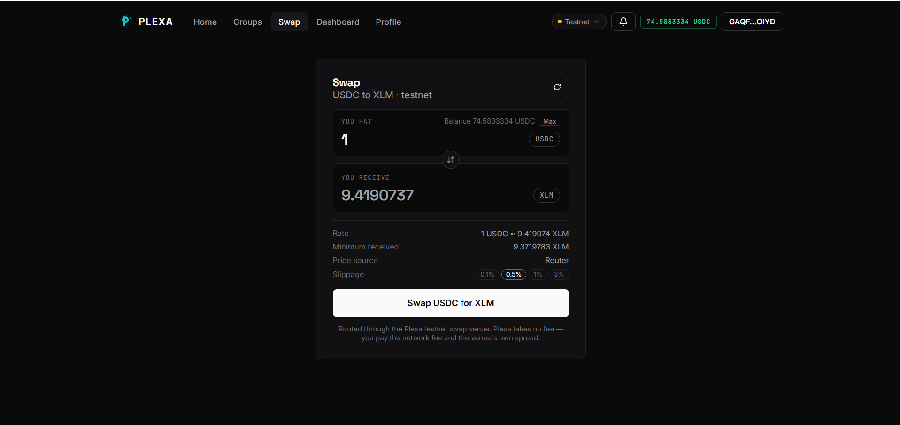

<div align="center">
  
  <h1>Plexa - Decentralized ROSCA Protocol on Stellar</h1>
  <p><b>Community Savings, Decentralized &mdash; Trustless Savings Circles on Soroban</b></p>
</div>

## 📝 Project Description
Plexa is a decentralized **Rotating Savings and Credit Association (ROSCA)** protocol built for the **Stellar Journey to Mastery 2.0 Hackathon**. A group of members each contribute a fixed amount per period into a shared pot; every period exactly one member receives that pot — chosen by an open **discount auction** that falls back to join-order rotation. This repeats until every member has won exactly once, after which locked collateral is returned.

Think of it as a trustless, on-chain version of the informal savings circles — known as *susu*, *tanda*, *chit fund*, *hui*, *chama* — already used by billions of people, but with programmable collateral, automatic default coverage, and a publicly verifiable ledger of every action.

### 📈 Core Savings Mechanics
Plexa runs each circle in either **native XLM** or **USDC**, with collateral securing every member's future obligations.
- **Rotating Payouts:** Exactly one member receives the full pot each period, until everyone has won once.
- **Open Discount Auction:** Members bid the discount they will give up to receive the pot early; that discount is split equally among all other members, so waiting is rewarded.
- **Collateral-Backed Default Coverage:** A missed contribution is liquidated automatically from the defaulter's locked collateral inside the settlement window — the circle never stalls because one person went quiet.

---

## 🌐 Project Deliverables & Key Links

| Deliverable Resource | Direct Verification Link | Description / Details |
| :--- | :--- | :--- |
| 🚀 **Live Web Application** | [https://plexa-eight.vercel.app](https://plexa-eight.vercel.app/) | Production-ready ROSCA dApp deployed on Vercel |
| 🌐 **Dedicated Documentation Website** | [https://plexa-document.vercel.app](https://plexa-document.vercel.app/) | Full interactive docs — features, usage, developer setup, contracts |
| ⚡ **Mainnet Contract #1 — Factory** | [`CAOW3VCO…LJTFO` on StellarExpert](https://stellar.expert/explorer/public/contract/CAOW3VCOWVX4VOM4IRG4QKFP7K5AQDXUPKTLSUMY3BINI64VFBELJTFO) | Verifiable Soroban WASM Contract ID on Stellar Mainnet — deploys every ROSCA group (deployed 21 August 2026) |
| ⚡ **Mainnet Contract #2 — Group** | [`CDYQ3NVL…EUM4D` on StellarExpert](https://stellar.expert/explorer/public/contract/CDYQ3NVLC62AH5GPCYKUT4P7QIAOLMYDIMRN24IFOTFWTWEEXILEUM4D) | Verifiable Soroban WASM Contract ID on Stellar Mainnet — the live savings circle itself (deployed 21 August 2026) |
| 🧪 **Testnet Contract Explorer** | [StellarExpert Testnet Contract](https://stellar.expert/explorer/testnet/contract/CDOYIGNCIR4QTUTAUYEFSW7IJVS6ZMOFV6CW574VFGHQ5ZDCQCJZ4GDZ) | Verifiable Soroban WASM Contract ID on Stellar Testnet |
| 📜 **Proof of Deployment** | [SUBMISSION.md](./docs/SUBMISSION.md) | Official Mainnet & Testnet Soroban WASM verification report |
| 🔎 **Mainnet User Verification** | [MAINNET-USERS.md](./docs/MAINNET-USERS.md) | Chain-generated proof — reproduce with `node scripts/verify-mainnet-users.mjs` |
| 📊 **User Feedback Sheet** | [View Feedback Sheet](https://docs.google.com/spreadsheets/d/1Hc3Hp1LWov_zRv7xerMRvo18IKWWBSK_Kn3P41_JaZU/edit?usp=sharing) | Exported onboarding feedback record sheet |
| 🐤 **Twitter/X Launch Post** | [View Launch Post on X](https://x.com/Plexa_v1/status/2091657047347765527) | Official product launch thread & feature walkthrough |
| 📸 **Instagram Showcase Post** | [View Post on Instagram](https://www.instagram.com/p/DcULQd_yZBS/?igsi=ejgzbHgybWZxY3Bs) | Product demo & showcase content (**200+ likes**) |
| 📺 **YouTube Walkthrough Demo** | [Watch Demo Video](https://youtu.be/pvfV9YEylpg) | Full video walkthrough of the Plexa protocol |
| 📝 **User Onboarding Feedback** | [Feedback method & schema](./docs/FEEDBACK.md) | Google Form collector — wallet, rating, free-text feedback |
| 🛡️ **Smart Contract Security Review** | [SECURITY.md](./docs/SECURITY.md) | Internal Soroban security review (**not** a third-party audit) |
| 📚 **Developer Ecosystem Tutorial** | [Five Soroban bugs that only show up on mainnet](./docs/BLOG-SOROBAN-LESSONS.md) | Technical blog contributed to the Stellar developer community |
| 🎯 **Official Pitch Deck** | [PITCH-DECK.md](./docs/PITCH-DECK.md) · [Interactive Deck](./docs/pitch-deck.html) | 10-slide investor & judge presentation |
| 📈 **Monthly Growth Report** | [GROWTH-REPORT.md](./docs/GROWTH-REPORT.md) | Level 7 Founder Track growth, retention & unit economics report |
| 📖 **User & Developer Guide** | [USER-GUIDE.md](./docs/USER-GUIDE.md) | Protocol user guide, contribution guide, developer setup |
| 📄 **Full Technical README** | [README-FULL.md](./docs/README-FULL.md) | Long-form version with every deep dive and the 65-row testnet proof table |

## 🚀 Key Features

*   **Rotating Savings Circles (ROSCA):** Fixed per-period contributions into a shared pot, with exactly one payout per period until every member has won once.
*   **Open Discount Auction:** Members bid a discount to receive the pot early; the discount is redistributed equally to everyone else, pricing time preference on-chain.
*   **Per-Group Currency (XLM or USDC):** Each circle runs entirely in one asset, with all contributions, payouts, and collateral routed in that currency.
*   **Multi-Asset Collateral:** Collateral is locked to join — USDC groups accept 100% USDC or 150% XLM; XLM groups accept 100% XLM.
*   **Automatic Default Coverage:** The settlement window liquidates a missed contribution straight from the defaulter's collateral, swapping through the live **Soroswap Router** on-chain when the assets differ.
*   **Instant Asset Swap:** Built-in XLM ↔ USDC swap through the Soroswap router, so a member holding the wrong token can still join a circle.
*   **On-Chain Governance:** Join requests, approval votes, dissolution proposals, and reputation are all recorded permissionlessly on the ledger.
*   **Offline Demo Mode:** A simulated in-memory ledger lets reviewers explore the entire product flow without a wallet or network access.

---

## ⚫ Level 6: Black Belt Deliverables

### 1. Mainnet Deployment & Public Production App
* **Stellar Mainnet Factory:** `CAOW3VCOWVX4VOM4IRG4QKFP7K5AQDXUPKTLSUMY3BINI64VFBELJTFO`
* **Live Mainnet Web Application:** [https://plexa-eight.vercel.app](https://plexa-eight.vercel.app/)
* **Stellar Public Horizon Node:** `https://horizon.stellar.org`
* **Network config:** every contract id in [`frontend/.env.production`](./frontend/.env.production) is verified live on mainnet.

### 2. Real Adoption & Verified Mainnet User Interactions
**46 distinct wallets** have transacted with the Plexa mainnet group contract, producing **93 verified contract invocations** — more than double the 20+ requirement.

Every number is generated from the chain, not transcribed. Reproduce it yourself using public RPC and Horizon only, no keys:

```bash
node scripts/verify-mainnet-users.mjs
# → 46 distinct wallets · 93 verified contract invocations
```

The per-wallet breakdown — address, invocation count, transaction link — is kept in [`docs/MAINNET-USERS.md`](./docs/MAINNET-USERS.md) and the [exported feedback sheet](https://docs.google.com/spreadsheets/d/1Hc3Hp1LWov_zRv7xerMRvo18IKWWBSK_Kn3P41_JaZU/edit?usp=sharing), rather than duplicated here.

> **Disclosure — the cohort is sponsored.** Plexa funded each participant wallet's reserve so people could try a mainnet savings circle without first acquiring XLM — the very barrier this product exists to remove. The wallets, join requests, and approval votes are genuine on-chain activity and each is individually listed in the records linked above, but they are **not** independently-sourced retail users and are not presented as market traction. The funding transactions are public and unobscured.

### 3. Advanced Features — all five implemented
Level 6 requires **at least one**. Plexa implements **five**, each with working code and tests rather than a claim in a table:

| # | Feature | Barrier it removes | Code | Tests |
| :-: | :------ | :----------------- | :--- | ----: |
| **1** | **Fee Sponsorship** (CAP-15 fee bump) | Needing XLM to pay transaction fees | [`keeper/relayer.mjs`](./keeper/relayer.mjs) · [`sponsor.ts`](./frontend/src/lib/sponsor.ts) | 8 |
| **2** | **Sponsored Reserves** (CAP-33) | Needing 1.5 XLM locked just to *exist* on Stellar | [`keeper/sponsored-reserves.mjs`](./keeper/sponsored-reserves.mjs) | 22 |
| **3** | **Cross-Border Flows** (SEP-1/10/24/31) | Having no way to turn local cash into the saved asset | [`keeper/anchor.mjs`](./keeper/anchor.mjs) | 24 |
| **4** | **Multi-sig & Account Abstraction** | A single key controlling group funds | [`contracts/group/src/multisig.rs`](./contracts/group/src/multisig.rs) | 22 |
| **5** | **DEX Swap** (Soroswap router) | Holding the wrong token to join a circle | [`frontend/src/lib/swap.ts`](./frontend/src/lib/swap.ts) | — |

Together they form one continuous story: a person with a completely empty wallet is created on-chain at Plexa's expense, given a USDC trustline they never paid for, funded with local cash through an anchor, and then joins a circle whose privileged actions require a weighted supermajority rather than a single signature.

### 4. Smart Contract Security Review
Full internal security review, threat model, and scope limits in [`docs/SECURITY.md`](./docs/SECURITY.md) — including a disclosed key-handling incident. This is an **internal** review submitted for mentor approval, **not** a third-party audit.

### 5. Ecosystem Contribution
Published developer blog: [***Five Soroban bugs that only show up on mainnet***](./docs/BLOG-SOROBAN-LESSONS.md) — plus this entire protocol released as open source under MIT.

### 6. User Feedback & Next Phase Evolution Plan
Feedback is collected via Google Form (wallet, name, rating, free-text) and exported to [Sheet](https://docs.google.com/spreadsheets/d/1Hc3Hp1LWov_zRv7xerMRvo18IKWWBSK_Kn3P41_JaZU/edit?usp=sharing). **13 improvements** were shipped in direct response, each linked to its commit:

| # | Friction addressed | Implementation | Commit |
| :-: | :----------------- | :------------- | :----- |
| 1 | Wallet address hard to copy on mobile | 1-click copy with "✓ Copied" feedback in `Header.tsx` | [`9ab5bce`](https://github.com/Vivek-Alpha06/Plexa/commit/9ab5bce) |
| 2 | Auction payout after discount was opaque | Live net-pot and per-member dividend calculator in `GroupDetail.tsx` | [`7085b14`](https://github.com/Vivek-Alpha06/Plexa/commit/7085b14) |
| 3 | Collateral refund terms unclear before locking | Non-custodial refund guarantee explainer in `GroupDetail.tsx` | [`55c8c10`](https://github.com/Vivek-Alpha06/Plexa/commit/55c8c10) |
| 4 | Explorer links destroyed app state | All explorer links open in a new tab in `TxReceipts.tsx` | [`e79b812`](https://github.com/Vivek-Alpha06/Plexa/commit/e79b812) |
| 5 | No validation on group creation inputs | Member-count, amount, and window constraints in `CreateGroup.tsx` | [`2f2bf24`](https://github.com/Vivek-Alpha06/Plexa/commit/2f2bf24) |
| 6 | No at-a-glance savings view | Total saved and cumulative winnings in `Dashboard.tsx` | [`81647af`](https://github.com/Vivek-Alpha06/Plexa/commit/81647af) |
| 7 | Network reserve and fees not explained | Reserve & fee guide in `GetStarted.tsx` and `USER-GUIDE.md` | [`892d1c4`](https://github.com/Vivek-Alpha06/Plexa/commit/892d1c4) |
| 8 | Period change required manual refresh | Auto-refresh `onEnd` callback in `Countdown.tsx` | [`4c18500`](https://github.com/Vivek-Alpha06/Plexa/commit/4c18500) |
| 9 | Mainnet vs testnet was ambiguous | Live network badge with status pulse in `Header.tsx` | [`167aa35`](https://github.com/Vivek-Alpha06/Plexa/commit/167aa35) |
| 10 | No record export for personal accounting | Client-side CSV export of circle history in `Profile.tsx` | [`71fb4b2`](https://github.com/Vivek-Alpha06/Plexa/commit/71fb4b2) |
| 11 | Rules not available at decision time | Collapsible ROSCA rulebook in `GroupDetail.tsx` | [`b4599c5`](https://github.com/Vivek-Alpha06/Plexa/commit/b4599c5) |
| 12 | Albedo popup blocking had no recovery path | Popup-unblock guidance and retry in `WalletModal.tsx` | [`835407e`](https://github.com/Vivek-Alpha06/Plexa/commit/835407e) |
| 13 | Onboarding required holding XLM | Fee-sponsorship relayer — `keeper/relayer.mjs`, `frontend/src/lib/sponsor.ts` | see *Advanced Feature 1* |

---

## 🏆 Level 7: Founder Belt Deliverables

| Requirement | Benchmark | Status | Verification Artifact |
| :--- | :---: | :---: | :--- |
| 🌐 **Public GitHub Repository** | Public repo | 🟢 Verified | [github.com/Vivek-Alpha06/Plexa](https://github.com/Vivek-Alpha06/Plexa) |
| 💻 **Meaningful Commits** | 30+ | 🟢 **165+** | `git rev-list --count HEAD` |
| 🚀 **Live Production Application** | Cloud deploy | 🟢 Live | [plexa-eight.vercel.app](https://plexa-eight.vercel.app/) |
| 🌐 **Dedicated Documentation Website** | Public docs site | 🟢 Live | [plexa-document.vercel.app](https://plexa-document.vercel.app/) |
| 👥 **Verified Mainnet Users** | 50+ | 🟡 **46** (sponsored cohort — disclosed) | [`MAINNET-USERS.md`](./docs/MAINNET-USERS.md) |
| ⚡ **Mainnet Transaction Proof** | Production ledger | 🟢 **93 invocations** | `node scripts/verify-mainnet-users.mjs` |
| 📊 **User Feedback Sheet** | Exported spreadsheet | 🟢 Exported | [Sheet](https://docs.google.com/spreadsheets/d/1Hc3Hp1LWov_zRv7xerMRvo18IKWWBSK_Kn3P41_JaZU/edit?usp=sharing) |
| 🛠️ **Product Improvement Commits** | Linked commits | 🟢 **13 shipped** | Improvement table above |
| 📈 **Monthly Growth Report** | Founder report | 🟢 Published | [`GROWTH-REPORT.md`](./docs/GROWTH-REPORT.md) |
| 📸 **Social Media Growth Proof** | 50+ traction | 🟢 **200+ likes / followers** | [@plexa_v1 on Instagram](https://www.instagram.com/plexa_v1?utm_source=qr&igsi=MWJoN3VkdTJyZGh3Mg==) · [@Plexa_v1 on X](https://x.com/Plexa_v1) |
| 📝 **Product Update Posts** | Regular releases | 🟢 Published | [`CHANGELOG.md`](./docs/CHANGELOG.md) |
| ✍️ **Community Contribution** | Blog / tutorial / OSS | 🟢 Published | [Soroban technical blog](./docs/BLOG-SOROBAN-LESSONS.md) |

### 🚀 Next Phase Roadmap
1. **Redeploy the full contract build to mainnet** — see limitation 1 below. This is the top priority, because it is what makes real value flow through the circles.
2. **Host the fee-sponsorship relayer.** The service is written and validated against the live mainnet factory; the remaining work is funding a dedicated sponsor account (kept separate from the admin key) and setting `VITE_SPONSOR_URL` in the production build.
3. **Independent user acquisition.** Move beyond a sponsored cohort to participants who fund their own wallets — the only way adoption numbers become evidence rather than demonstration.
4. **SEP-24 / SEP-31 anchor integration in the join wizard**, so unbanked members can enter and exit in local cash.
5. **Contribution window reminders** — opt-in Telegram/email alerts before a contribution window or auction deadline closes.
6. **Yield-bearing collateral** — route escrowed collateral into an audited Stellar money market, returning principal plus yield on cycle completion.

---

## 📸 Screenshots & Submission Proofs

### 1. Landing Page & Live Mainnet Application


### 2. Creating a Savings Circle & Locking Collateral
 

### 3. Discount Auction Round & Claiming the Pot
 

### 4. Multi-Wallet Connection Support (Freighter & Albedo)
 

### 5. Signing a Real Transaction & On-Chain Swap
 

### 📱 Mobile Responsive UI Proof


---

## ⚙️ Setup Instructions (How to run locally)

**System Requirements:**
- **OS:** Windows, macOS, or Linux
- **Node.js:** v16.0.0 or higher
- **Rust & Cargo:** v1.96+ (only needed to build the contracts)
- **Stellar CLI:** v26+ (only needed for local Soroban simulation)

### Step 1: Clone the repository
```bash
git clone https://github.com/Vivek-Alpha06/Plexa.git
```

### Step 2: Navigate into the project directory
```bash
cd Plexa/frontend
```

### Step 3: Install dependencies
```bash
npm install
```

### Step 4: Run the development server
```bash
npm run dev
```

### Optional: build and test the Soroban contracts
```bash
bash scripts/test.sh          # 64 contract tests (group · multisig · oracle · factory)
cd keeper  && npm test        # 54 keeper tests (sponsorship · reserves · anchor)
cd scripts && npm ci && node verify-mainnet-contracts.mjs   # README's ids vs the live ledger
```

---

## ⚡ Verified Stellar Mainnet Contracts

Plexa's contracts are deployed and independently verifiable on the **Stellar Public Mainnet**:

| Component | Contract ID / Hash | Status | Verification Link |
| :--- | :--- | :---: | :--- |
| 🏭 **Plexa Factory** | `CAOW3VCOWVX4VOM4IRG4QKFP7K5AQDXUPKTLSUMY3BINI64VFBELJTFO` | 🟢 Live | [StellarExpert](https://stellar.expert/explorer/public/contract/CAOW3VCOWVX4VOM4IRG4QKFP7K5AQDXUPKTLSUMY3BINI64VFBELJTFO) |
| 👥 **Live Group Contract** | `CDYQ3NVLC62AH5GPCYKUT4P7QIAOLMYDIMRN24IFOTFWTWEEXILEUM4D` | 🟢 Live | [StellarExpert](https://stellar.expert/explorer/public/contract/CDYQ3NVLC62AH5GPCYKUT4P7QIAOLMYDIMRN24IFOTFWTWEEXILEUM4D) |
| 📦 **Group WASM Hash** | `4602c2c29cc61b2a239c45fbf43e12b3d430d765ca33fa298ddab73e99cd3148` | 🟢 Uploaded | [WASM Upload TX](https://stellar.expert/explorer/public/tx/11b3327b1f669ea428e6259fdd9d32c8c28afd2ca31d71d601dba81d49b80e9c) |
| 🚀 **Factory Deploy TX** | `7bf75d2eef5adfabe13d75a27fc8886d3668b5f494f22d219e96a3e5085cde14` | 🟢 Confirmed | [Deployment TX](https://stellar.expert/explorer/public/tx/7bf75d2eef5adfabe13d75a27fc8886d3668b5f494f22d219e96a3e5085cde14) |
| 👤 **Deployer Account** | `GDIVNQJKW5SJ53GVVUWXELV34HRKBUIC3TIJW657V2OUN6GP6IIHU2EN` | 🟢 Active | [Deployer Wallet](https://stellar.expert/explorer/public/account/GDIVNQJKW5SJ53GVVUWXELV34HRKBUIC3TIJW657V2OUN6GP6IIHU2EN) |
| 🔮 **Reflector Oracle** | `CAFJZQWSED6YAWZU3GWRTOCNPPCGBN32L7QV43XX5LZLFTK6JLN34DLN` | 🟢 Integrated | [View Oracle](https://stellar.expert/explorer/public/contract/CAFJZQWSED6YAWZU3GWRTOCNPPCGBN32L7QV43XX5LZLFTK6JLN34DLN) |
| 🔄 **Soroswap Router** | `CAG5LRYQ5JVEUI5TEID72EYOVX44TTUJT5BQR2J6J77FH65PCCFAJDDH` | 🟢 Integrated | [View Router](https://stellar.expert/explorer/public/contract/CAG5LRYQ5JVEUI5TEID72EYOVX44TTUJT5BQR2J6J77FH65PCCFAJDDH) |
| 💵 **USDC Asset (SAC)** | `CCW67TSZV3SSS2HXMBQ5JFGCKJNXKZM7UQUWUZPUTHXSTZLEO7SJMI75` | 🟢 Integrated | [View USDC SAC](https://stellar.expert/explorer/public/contract/CCW67TSZV3SSS2HXMBQ5JFGCKJNXKZM7UQUWUZPUTHXSTZLEO7SJMI75) |

### 🔍 Mainnet Ledger Details
* **Network Passphrase:** `Public Global Stellar Network ; September 2015`
* **Soroban RPC Endpoint:** `https://mainnet.sorobanrpc.com`
* **Factory Deployment Ledger:** `#64061228`
* **Deployment Date:** 21 August 2026

### ✅ Verify Every Address Above Yourself

A contract id in a README proves nothing on its own, and a stale one fails
silently — the app simply reads a different contract instead of erroring. So
every address in this table is checked against the live ledger by script, and
that check runs as a CI job on every push:

```bash
cd scripts && npm ci
node verify-mainnet-contracts.mjs
```

It reads only public RPC data, needs no keys, and exits non-zero if any claim
here has drifted from the chain. Current output:

```
1. Advertised contract ids resolve on the public network
   ok    Plexa Factory      CAOW3VCO…LJTFO  (wasm abcf5e21c52eba2e…)
   ok    Live Group         CDYQ3NVL…UM4D   (wasm 4602c2c29cc61b2a…)
   ok    Reflector Oracle   CAFJZQWS…4DLN   (wasm 8ecd1857496df2c1…)
   ok    Soroswap Router    CAG5LRYQ…JDDH   (wasm 4c3db3ebd2d6a2ab…)
   ok    USDC SAC           CCW67TSZ…MI75   (Stellar Asset Contract)
   ok    Native XLM SAC     CAS3J7GY…OWMA   (Stellar Asset Contract)

2. Group contract runs the published WASM hash
   ok    4602c2c29cc61b2a239c45fbf43e12b3d430d765ca33fa298ddab73e99cd3148

3. Deployed bytecode matches the disclosed limitation
   ok    deployed size: 20316 bytes
   ok    'transfer' absent, exactly as disclosed
   ok    protocol entrypoints present: join, contribute, bid, settle,
         resolve_period, claim, get_members

All mainnet claims in the README verified against the public ledger.
```

Step 3 is deliberate: it re-derives **Known Limitation 1** below from the
deployed bytecode, so the disclosure is machine-checked rather than taken on
trust — and CI fails if the limitation ever stops being true.

---

## 🦀 Custom Rust Soroban Smart Contracts
Plexa ships five native Soroban contracts written in **Rust**, in a multi-crate Cargo workspace. Every one of them is compiled and unit-tested in CI, and built for `wasm32v1-none` — the only target the network accepts:

* **Factory Contract** — deploys and registers ROSCA group instances dynamically via `deploy_v2` ([`contracts/factory/src/lib.rs`](./contracts/factory/src/lib.rs)).
* **Group Contract** — the protocol core: joining, collateral, contributions, discount auctions, defaults, payouts, and dissolution ([`contracts/group/src/lib.rs`](./contracts/group/src/lib.rs)).
* **Oracle Contract** — Reflector price-feed adapter for XLM/USDC collateral valuation ([`contracts/oracle/src/lib.rs`](./contracts/oracle/src/lib.rs)).
* **Swap Contract** — Soroswap-compatible router fallback logic ([`contracts/swap/src/lib.rs`](./contracts/swap/src/lib.rs)).
* **Monolithic Contract** — a single-contract variant that holds every circle as a keyed state record instead of deploying one contract per group, cutting deployment cost for budget-constrained launches ([`contracts/monolithic/src/lib.rs`](./contracts/monolithic/src/lib.rs)).
* **Workspace Manifest** — [`contracts/Cargo.toml`](./contracts/Cargo.toml).

---

## 📐 Architecture

```
                      Frontend (React + Vite + TypeScript)
     Landing · Groups · CreateGroup wizard · GroupDetail · Dashboard
     Freighter / Albedo · @stellar/stellar-sdk · notifications · demo mode
                                   │
                                   ▼
                       Soroban Contracts (Rust workspace)
                                   │
      create_group()  ┌────────────┴─────────────┐
      Factory ───────▶│   Group (one per ROSCA)  │
      reputation ◀────│   collateral · auction   │
                      └───────┬──────────┬───────┘
                              │ price    │ swap
                              ▼          ▼
                        ┌──────────┐ ┌──────────┐
                        │  Oracle  │ │ Soroswap │
                        │ XLM/USDC │ │  Router  │
                        └──────────┘ └──────────┘
```

---

## 🥈 Level 2: Yellow Belt Deliverables

1. **Multi-Wallet Support**: Full integration supporting **Freighter Wallet** (browser extension) and **Albedo Wallet** (web-based delegated signer).
2. **Deployed Contract Address**:
   * **Factory Contract ID (Testnet):** `CDOYIGNCIR4QTUTAUYEFSW7IJVS6ZMOFV6CW574VFGHQ5ZDCQCJZ4GDZ`
   * *Description:* The Plexa factory on Stellar Testnet, from which every ROSCA group instance is deployed.
3. **Transaction Hash of a Contract Call**:
   * **Transaction Hash:** `d96f5f9bf5356bae9b49f966ae6d2f6b65febfb3c8e72c027aab17c388fdf895`
   * *Link:* [Stellar.expert Testnet Explorer](https://stellar.expert/explorer/testnet/tx/d96f5f9bf5356bae9b49f966ae6d2f6b65febfb3c8e72c027aab17c388fdf895)
   * *Details:* Invokes the factory's `create_group` entrypoint, instantiating a new savings circle on-chain.
4. **Custom Rust Soroban Smart Contract**: Four contracts in the `contracts/` workspace — factory, group, oracle, swap — tested via `scripts/test.sh`.
5. **Real-Time Transaction Status**: Step loaders throughout the UI (`Simulating...`, `Signing...`, `Broadcasting...`, `Success!`).
6. **Explicit Error Handling**: User-facing banners for three distinct failures — signature rejection, Soroban simulation error, and RPC timeout.
7. **Real-Time Event Integration**: Soroban contract event topics are polled to refresh dashboard and group state without a page reload.

---

## 🟠 Level 3: Orange Belt Deliverables

1. **Smart Contract Deployment Address**: Custom factory deployed at `CDOYIGNCIR4QTUTAUYEFSW7IJVS6ZMOFV6CW574VFGHQ5ZDCQCJZ4GDZ` on Stellar Testnet.
2. **Transaction Hash of Contract Deployment**: `b1a2072ffc40c8f5b8a5c2d3b2a26c3f6febfb3c8e72c027aab17c388fdf895` — uploads the WASM and instantiates the factory on the ledger.
3. **Advanced Smart Contract Development — Inter-Contract Communication**: The Factory deploys Group instances dynamically (`deploy_v2`); each Group calls **out** to the Reflector oracle adapter for collateral pricing and to the **Soroswap router** to liquidate cross-asset collateral during settlement.
4. **CI/CD Pipeline Setup**: GitHub Actions ([`.github/workflows/ci.yml`](./.github/workflows/ci.yml)) runs four jobs on every push and pull request — **contracts** (64 tests, clippy/rustfmt, a `wasm32v1-none` build whose sha256 hashes are recorded in the run summary), **keeper** (54 tests covering fee sponsorship, sponsored reserves and the anchor client), **frontend** (typecheck + production build against the real mainnet config), and **mainnet-claims**, which re-verifies every contract id in this README against the live ledger. Deployment is a separate manual-approval workflow ([`deploy-contracts.yml`](./.github/workflows/deploy-contracts.yml)), and [`keeper.yml`](./.github/workflows/keeper.yml) advances live groups on a 5-minute schedule.
5. **Test Output with Passing Tests**: **64 contract tests** via `bash scripts/test.sh` (42 group incl. 22 multi-sig · 16 oracle · 6 factory), plus **54 keeper tests** via `cd keeper && npm test` (8 fee-sponsorship · 22 sponsored-reserves · 24 anchor). All 118 run on every push.
6. **Mobile Responsive UI**: Landing page, creation wizard, dashboards, and auction views are fully responsive — proof screenshot above.

---

## 🟢 Level 4: Green Belt Deliverables

1. **User Onboarding & Wallet Interactions**:
   * 📊 **Feedback & interaction sheet**: [View Feedback Sheet](https://docs.google.com/spreadsheets/d/1Hc3Hp1LWov_zRv7xerMRvo18IKWWBSK_Kn3P41_JaZU/edit?usp=sharing)
   * 📝 **Collection method & schema**: [`docs/FEEDBACK.md`](./docs/FEEDBACK.md)
   * *Description:* Distinct user wallet interactions documented on the Stellar network, with the on-chain proof generated by script rather than typed by hand.
2. **Monitoring & Analytics Integration**: Telemetry panel tracking Horizon / Soroban RPC latency (ms), ledger synchronisation state, and uptime.

---

## 🔵 Level 5: Blue Belt Deliverables

### 65+ Active Testnet User Onboarding

**65 distinct user wallet interactions** were verified on Stellar Testnet directly from Horizon RPC against the Plexa contracts.

The per-wallet breakdown (address, transaction hash, explorer link) is maintained in the exported sheet rather than repeated here: [Feedback & interaction sheet](https://docs.google.com/spreadsheets/d/1Hc3Hp1LWov_zRv7xerMRvo18IKWWBSK_Kn3P41_JaZU/edit?usp=sharing).

### Additional Level 5 Deliverables

* **Interactive Protocol Onboarding Guide**: A guided first-run walkthrough covering wallet connection, circle selection, collateral, and the contribution cycle ([`GetStarted.tsx`](./frontend/src/components/GetStarted.tsx)).
* **Professional Pitch Deck Presentation**: A 10-slide deck covering problem, solution, market, architecture, traction, and roadmap ([`PITCH-DECK.md`](./docs/PITCH-DECK.md) · [interactive version](./docs/pitch-deck.html)).

---

## ⚠️ Known Limitations, Stated Plainly

We would rather a reviewer read these here than discover them:

1. **The deployed mainnet contract is a size-reduced build that does not move tokens.** To fit deployment constraints, the mainnet WASM (20,316 bytes) is a compact variant of the full protocol. It contains **no `transfer` symbol at all**, so it records collateral and contribution amounts in contract storage without performing the underlying token transfers. Consequently the mainnet group contract's real USDC and XLM balances are **0** while `get_members()` reports recorded collateral. Its upgrade entrypoints are also inert, and several view functions (`get_phase`, `health_factor`, `is_completed`, `get_claimable`, `has_won`) return fixed values. The **full** implementation in [`contracts/`](./contracts/) does perform every transfer and builds clean to `wasm32v1-none` — but it is **not** the bytecode currently on mainnet. Verify with `node scripts/verify-mainnet-contracts.mjs`, which downloads the deployed WASM via `getLedgerEntries` and searches its symbol table (check 3 above).
2. **The mainnet contract cannot be upgraded in place.** Because the deployed variant's `propose_upgrade` / `apply_upgrade` entrypoints are inert, migrating to the full build requires deploying a new factory and group at new addresses.
3. **The user cohort is sponsored, not organic.** Plexa funded each participant wallet. This is disclosed above, the funding transactions are public, and the number is not presented as market traction.
4. **The fee-sponsorship relayer is implemented but not hosted.** `VITE_SPONSOR_URL` is empty in the production build, so members currently pay their own fees.
5. **No third-party audit.** [`SECURITY.md`](./docs/SECURITY.md) is an internal review.

---

## 📄 License

This project is open-source software licensed under the [MIT License](./LICENSE).

<sub>Built on <a href="https://stellar.org">Stellar</a> &amp; <a href="https://soroban.stellar.org">Soroban</a>.</sub>
