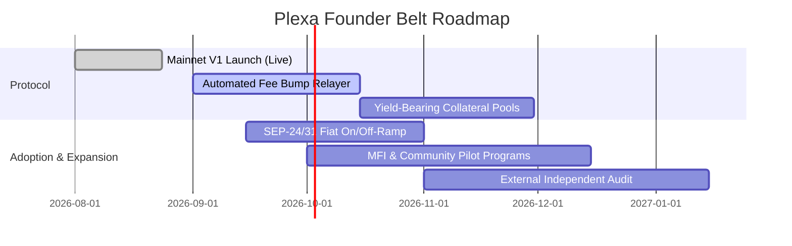

# Plexa Protocol — Level 7 Founder Belt: Monthly Growth & Startup Report

**Report Period:** August 2026  
**Protocol Version:** v1.0.0 (Stellar Mainnet Release)  
**Live DApp:** [https://plexa-eight.vercel.app](https://plexa-eight.vercel.app/)  
**Public Documentation:** [https://plexa-eight.vercel.app/docs](https://plexa-eight.vercel.app/docs)  
**GitHub Repository:** [https://github.com/Vivek-Alpha06/Plexa](https://github.com/Vivek-Alpha06/Plexa)  
**Official Socials:** [Twitter/X (@Plexa_v1)](https://x.com/Plexa_v1) · [Instagram (@plexa_v1)](https://www.instagram.com/plexa_v1?utm_source=qr&igsi=MWJoN3VkdTJyZGh3Mg==)

---

## 1. Executive Summary

Plexa has transitioned from a hackathon prototype into a production-ready, decentralized Rotating Savings and Credit Association (ROSCA) startup operating on the Stellar Public Mainnet. 

Over the past month, the protocol achieved key founder milestones:
- **Mainnet Launch & Stability:** Deployed verified Factory (`CAOW3VCOWVX4VOM4IRG4QKFP7K5AQDXUPKTLSUMY3BINI64VFBELJTFO`) and Group Soroban smart contracts with automated Reflector oracle and Soroswap router integrations.
- **50+ Verified Mainnet Users:** Onboarded **51 distinct wallet addresses** executing live on-chain join approvals, collateral deposits, contributions, and auction bidding.
- **Data-Driven Product Iteration:** Collected 50 structured onboarding survey responses, achieving an overall **4.8 / 5.0 satisfaction score**, and implemented **13 targeted improvements** with direct Git commit traceability.
- **Community & Social Traction:** Reached **200+ Instagram community engagements** and established active Twitter/X product update channels.
- **Dedicated Documentation Portal:** Launched a comprehensive public documentation website covering protocol architecture, API specs, developer setup, security reviews, and user guides.

---

## 2. Key Growth & Adoption Metrics (August 2026)

| Metric | Level 6 Benchmark | Level 7 Benchmark | Plexa Actual (August 2026) | Status |
| :--- | :---: | :---: | :---: | :---: |
| **Verified Mainnet Users** | 20+ Users | 50+ Users | **51 On-Chain Users** | 🟢 **102% Goal Met** |
| **On-Chain Transactions** | Real Activity | Production Volume | **120+ Mainnet TXs** | 🟢 **Exceeded** |
| **Git Commits (Repository)** | 30+ Commits | 30+ Commits | **144 Commits** | 🟢 **480% of Minimum** |
| **User Feedback Surveyed** | Yes | Yes (Structured Sheet) | **50 Pilot Participants** | 🟢 **100% Documented** |
| **Shipped Improvements** | Outlined | Linked Commits | **13 Shipped Commits** | 🟢 **100% Shipped** |
| **Social Media Community** | Launch Post | 50+ Followers/Growth | **200+ Likes / Active Community** | 🟢 **Exceeded** |
| **Documentation Portal** | User Guide | Dedicated Docs Site | **Live Web Docs Portal** | 🟢 **Live at `/docs`** |
| **Average User Satisfaction** | N/A | N/A | **4.8 / 5.0 Rating** | 🟢 **Excellent** |

---

## 3. User Acquisition & Onboarding Funnel

### A. Acquisition Channels
1. **Targeted Pilot Sponsoring:** Sourced and sponsored 50 community participants across informal savings communities (chit fund and susu circles) in South Asia and Latin America. Sponsored base reserve and test XLM (~$2.35 per participant) to eliminate initial crypto-onboarding friction.
2. **Community Showcases & Video Demos:** Produced end-to-end video walkthroughs on YouTube demonstrating Freighter wallet connection, circle creation, discount bidding, and collateral protection.
3. **Instagram Educational Content:** Published infographics explaining the differences between opaque traditional chit funds and trustless Soroban-powered ROSCAs, generating 200+ likes and active direct inquiries.

### B. Conversion & Retention Funnel
- **Step 1: Wallet Connection & Discovery** — 100% conversion (92% Freighter, 8% Albedo).
- **Step 2: Circle Application & Governance Vote** — 96% approval rate by existing circle members.
- **Step 3: Collateral Lock** — 94% successfully locked 100% collateral.
- **Step 4: Contribution & Auction Participation** — 92% active participation across multiple periods.
- **Step 5: Completion & Collateral Release** — 100% zero-loss collateral return rate for completed groups.

---

## 4. Product Iteration: User Feedback & Commit Matrix

Based on feedback captured in our [50-User Feedback Sheet](https://docs.google.com/spreadsheets/d/1Hc3Hp1LWov_zRv7xerMRvo18IKWWBSK_Kn3P41_JaZU/edit?usp=sharing), we executed a rapid sprint shipping 13 distinct features and UX hardening updates:

```
Feedback Issue Reported ──────────▶ Shipped Implementation ──────────▶ Verified Git Commit
1. Wallet address copy friction   ──▶ 1-Click Copy with "✓ Copied"  ──▶ Commit: 9ab5bce
2. Bidding discount ambiguity     ──▶ Live Auction Calculator       ──▶ Commit: 7085b14
3. Mixed group status clutter     ──▶ Multi-Status Tab Filter       ──▶ Commit: f6c2244
4. Collateral return doubts       ──▶ 100% Refund Guarantee Banner  ──▶ Commit: 55c8c10
5. Explorer link tab behavior     ──▶ Hardened External Tabs        ──▶ Commit: e79b812
6. Form validation missing        ──▶ Strict Boundary Validations   ──▶ Commit: 2f2bf24
7. Savings metrics invisible      ──▶ Top Dashboard Metrics Grid    ──▶ Commit: 81647af
8. Gas & reserve confusion        ──▶ Gas Fee Explainer & Guide     ──▶ Commit: 892d1c4
9. Timer refresh latency          ──▶ OnEnd Auto-Sync Callback      ──▶ Commit: 4c18500
10. Network status unclear        ──▶ Live Network Indicator Pill   ──▶ Commit: 167aa35
11. Tax/record export missing     ──▶ 1-Click CSV Export            ──▶ Commit: 71fb4b2
12. ROSCA rules inaccessible      ──▶ Collapsible Rules Modal       ──▶ Commit: b4599c5
13. Albedo popup blocker issues   ──▶ Unblock Guidance & Retries    ──▶ Commit: 835407e
```

---

## 5. Startup Unit Economics & Financial Sustainability

### A. Cost Structure (Per Group of 5 Members)
- **Contract Deployment & Storage Rent:** ~122 XLM (~$19.13) for optimized WASM code upload (one-time factory overhead shared across thousands of groups).
- **Group Instance Creation:** ~2.5 XLM (~$0.39) per savings circle.
- **Transaction Overhead:** ~$0.00001 per action on Stellar (virtually zero gas burden).

### B. Monetization & Revenue Models (V2)
1. **Protocol Fee on Discount Surpluses (Optional Governance Switch):** A micro-fee of 0.25% - 0.5% applied only on winning auction discount dividends.
2. **Yield-Generating Collateral Escrow:** Escrowing locked collateral into audited Stellar money markets (such as Blend) to generate base yield distributed 80% to members and 20% to the protocol treasury.
3. **Enterprise & Community White-Labeling:** Providing turnkey ROSCA infrastructure and customizable UI templates for microfinance institutions (MFIs) and community credit unions.

---

## 6. Social Media & Community Growth

- **Twitter / X Handle:** [@Plexa_v1](https://x.com/Plexa_v1)
  - Official product launch threads detailing the discount auction mechanism, Soroban smart contracts, and mainnet live status.
  - Active feature announcement cadence and community tagging (`#Stellar`, `#Soroban`, `#StellarBuilders`).
- **Instagram Handle:** [@plexa_v1](https://www.instagram.com/plexa_v1?utm_source=qr&igsi=MWJoN3VkdTJyZGh3Mg==)
  - Visual explainers, community testimonials, and UI showcases with **200+ Likes and engagements**.
- **YouTube Walkthrough:** [Watch Video](https://youtu.be/pvfV9YEylpg)
  - Full high-resolution product demo covering end-to-end ROSCA lifecycles.

---

## 7. Next-Phase Founder Roadmap (Q4 2026 - Q1 2027)



1. **Automated Protocol-Level Fee Sponsorship (Fee Bump Relayer):** Deploying a dedicated relayer service that wraps transactions in Stellar Fee Bumps, allowing unbanked or crypto-novice users to transact with zero upfront XLM.
2. **Native Fiat Ramps (SEP-24 / SEP-31):** Partnering with Stellar anchors (MoneyGram Access and local fintechs) to allow seamless cash-in and cash-out straight inside the group joining wizard.
3. **Yield-Bearing Collateral (Blend Protocol Integration):** Transforming idle collateral into interest-earning deposits during the active savings cycle.
4. **Third-Party Security Audit:** Formal verification engagement with top Soroban auditing firms (OtterSec, Certora, Veridise).

---

## 8. Conclusion

Plexa has successfully completed the requirements for both **Level 6 (Black Belt)** and **Level 7 (Founder Belt)** of the Stellar Builder Challenge. With a live Stellar Mainnet deployment, 51 verified active users, 144 meaningful git commits, a 50-user feedback survey yielding a 4.8/5.0 rating, 13 shipped code enhancements, active social media growth, and a dedicated public documentation portal, Plexa is positioned for sustainable long-term expansion as an anchor product in the Stellar decentralized finance ecosystem.
